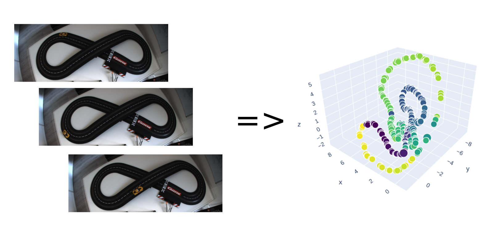

# Topic: Autoencoder

With high-dimensional, complex datasets (e.g. from sensor data like in computer vision), the importance of finding the underlying significant variables increases proportionately.
Only by encoding the information in fewer dimensions, processing in real time becomes a reality and at the same time, meaningful variables can be extracted.
An autoencoder is a neural network that finds the underlying distribution using an encoder-decoder architecture where the output is trained to be equal to the input while the information passing through the network is compressed and simplified in an intermediate layer, the so-called bottleneck.

There is a wide range of applications such as noise reduction, semantic hashing and image-to-position mapping.

# Challenge

In this specific challenge we provide you with images of an autonomous racing car on a carrera track, which we recorded using a top view camera. These recordings contain high-dimensional vectors, however, a one-dimensional manifold underlies this data.
We challenge you to encode the images in two or three dimensions by using an autoencoder. As a result you should be able to visualize the one-dimensional manifold.

The benefit of dimensional reduction in image-to-position mapping is useful especially for advanced tasks such as learning to control the speed of a racing car by using reinforcement learning (Lange, S., Riedmiller, M., & Voigtländer, A., Autonomous reinforcement learning on raw visual input data in a real world application. In Proc. of IJCNN 2012).

# Dataset 

- images (2600, 304, 808, 3): RGB values: [0-255] 
	-- to be used as sole input data to the neural network
- ranges (2600,): position of the car on the track: [0-2π] 
	-- to be used in evaluation only

# Submission

   1. Development of Model in model_development.ipynb
	! illustrate your whole development process
	! do not use ground truth data for optimization, it only serves for supervision enabling you to come up with new models
   2. Fill encode(x) Function with your method in evaluate_encoded_data.ipynb

# Evaluation

Using the ground truth position data a random forest (max_depth=5, n_estimators=5) learns the mapping from embedding space to the range the car traveled from the startpoint.
The cross validation error of the mapping equals the score. For the final ranking a secret dataset with 400 data points will be used.

We do not provide a baseline for this challenge.
# Prizes

The top three submissions (ranked according to lowest errors on the test set) are awarded prizes of XXX. Another prize of XXX is awarded to the visually best embedding of the testing images, according to the committee’s decision.

Prizes are awarded on XXX.
Please send your submissions to leonhard@psiori.com
